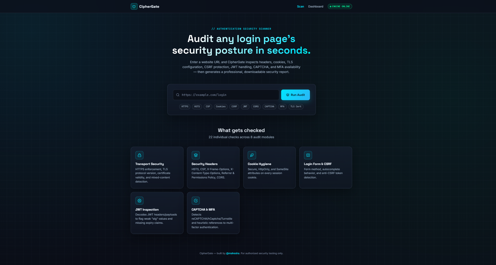
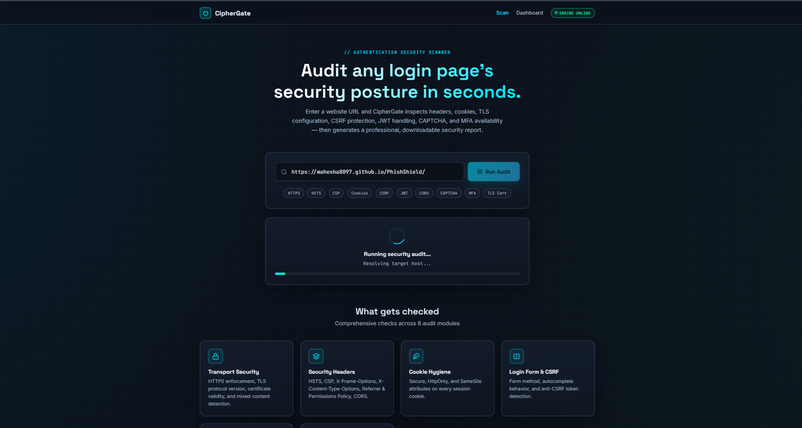
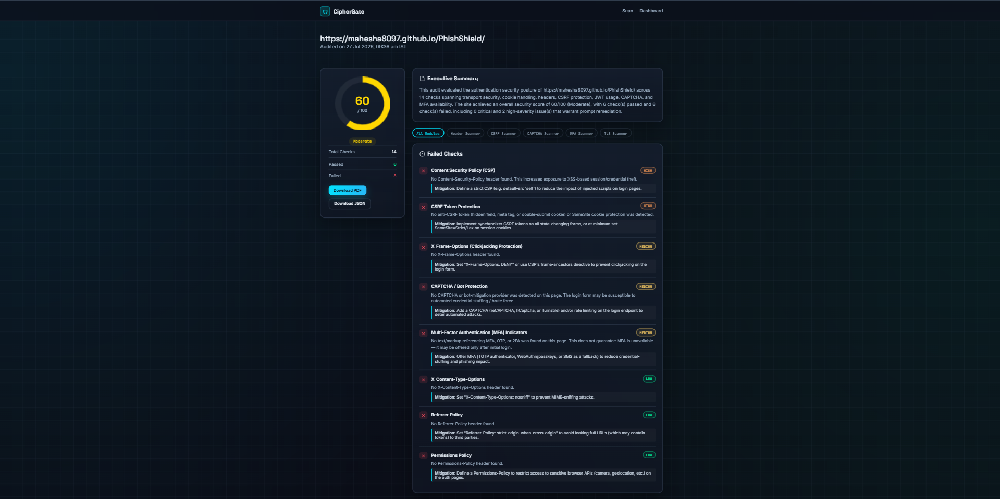
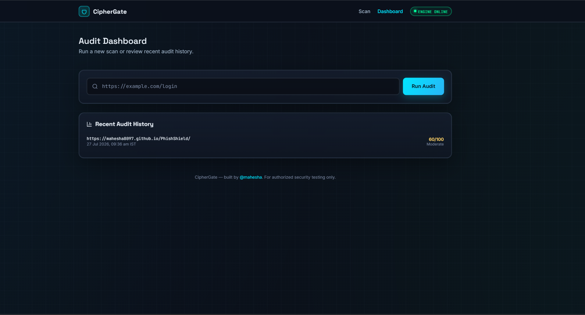
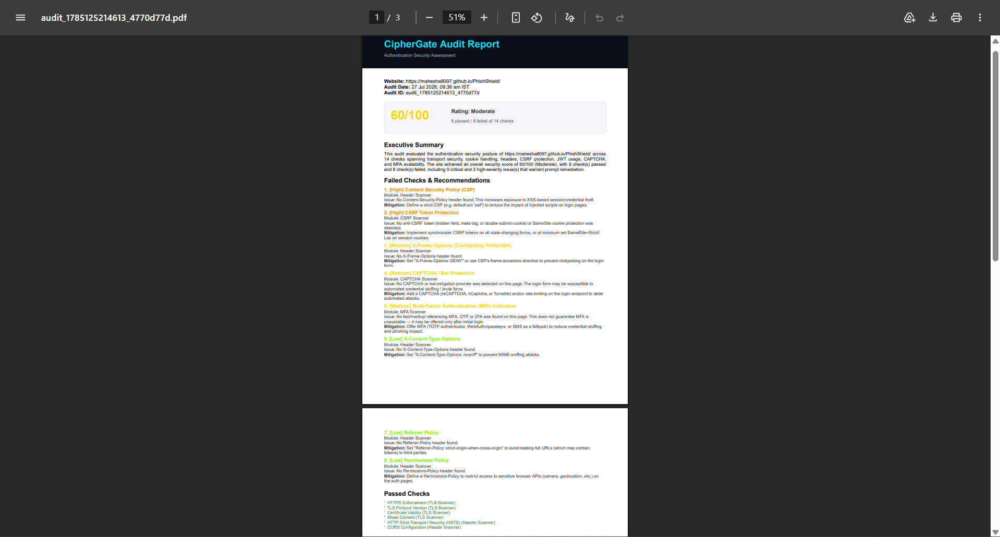

# 🔐 CipherGate

**CipherGate** is a full-stack authentication security scanner. Give it a website URL and it audits the login page's security posture — HTTPS/TLS, security headers, cookies, CSRF protection, JWT handling, CAPTCHA, and MFA availability — then generates a professional, downloadable report with a 0–100 security score.

Built by **Mahesha** as a cybersecurity + full-stack development project.


---

## ✨ Features

- **Automated checks across 8 audit modules** (the exact count varies per site — informational-only findings, such as "no JWT detected," aren't scored but are still shown)
  - **TLS Scanner** — HTTPS enforcement, TLS protocol version, certificate validity/expiry, mixed content
  - **Header Scanner** — HSTS, CSP, X-Frame-Options, X-Content-Type-Options, Referrer-Policy, Permissions-Policy, CORS misconfiguration
  - **Cookie Scanner** — Secure, HttpOnly, SameSite attributes on every cookie
  - **Login Scanner** — form method, autocomplete/password-manager compatibility, "Remember Me" detection
  - **CSRF Scanner** — hidden-field tokens, meta-tag tokens, double-submit cookie pattern
  - **JWT Scanner** — decodes JWT header/payload, flags `alg: none`, weak algorithms, missing expiry
  - **CAPTCHA Scanner** — detects reCAPTCHA, hCaptcha, Cloudflare Turnstile, Arkose/FunCaptcha
  - **MFA Scanner** — heuristic detection of OTP/2FA/passkey references
- **0–100 security score** with Excellent / Good / Moderate / Weak / Critical rating bands
- **Downloadable reports** — a polished PDF (via PDFKit) and a structured JSON export
- **Dark, glassmorphic dashboard** with an animated score ring (Chart.js), live scan progress, and audit history
- **Security-conscious by default** — Helmet CSP, global + endpoint-specific rate limiting, strict URL validation, and guards against scanning internal/private (SSRF-prone) addresses

## 🖼️ Screenshots

### Scan Page


### Live Audit Progress


### Security Report Overview


### Audit History Dashboard


### Downloadable PDF Report


## 🧱 Tech Stack

| Layer | Technology |
|---|---|
| Frontend | HTML5, CSS3 (custom glassmorphic theme), Vanilla JavaScript, Chart.js |
| Backend | Node.js, Express.js |
| HTTP / HTML Parsing | Axios, Cheerio |
| Security Middleware | Helmet, express-rate-limit, CORS, cookie-parser |
| Reporting | PDFKit (PDF), native JSON |
| Logging | Morgan + a custom request logger |
| Utilities | dotenv, uuid, jsonwebtoken / jwt-decode |

> **Design note:** the audit engine analyzes the static HTML/HTTP response of a target page (via `axios` + `cheerio`) rather than rendering it in a headless browser. This keeps the tool lightweight and dependency-free to install. Headless-browser rendering for JavaScript-heavy/SPA login pages is listed under *Future Improvements* below.

## 📁 Folder Structure

```
ciphergate/
│
├── server.js                  # Express app entry point
├── package.json
├── .env.example
├── .gitignore
├── README.md
│
├── routes/
│   ├── audit.js                # POST /audit, GET /audit/history
│   └── report.js                # GET /report/pdf/:id, GET /report/json/:id
│
├── controllers/
│   ├── auditController.js       # orchestrates the scan pipeline
│   └── reportController.js      # serves report downloads
│
├── services/
│   ├── headerScanner.js
│   ├── cookieScanner.js
│   ├── loginScanner.js
│   ├── tlsScanner.js
│   ├── csrfScanner.js
│   ├── jwtScanner.js
│   ├── captchaScanner.js
│   ├── mfaScanner.js
│   ├── scoreCalculator.js       # combines all findings into a 0-100 score
│   └── reportGenerator.js       # builds the JSON report and renders the PDF
│
├── utils/
│   ├── validator.js             # URL validation + basic SSRF guarding
│   ├── helpers.js
│   └── constants.js             # scoring weights, severities, detection signatures
│
├── middleware/
│   ├── errorHandler.js
│   └── logger.js
│
├── public/
│   ├── css/style.css
│   ├── js/main.js               # scan form logic (landing page)
│   ├── js/dashboard.js          # audit history + quick scan
│   ├── js/report.js             # renders the report page
│   └── images/
│
├── views/
│   ├── index.html               # scan landing page
│   ├── dashboard.html           # audit history dashboard
│   └── report.html              # report viewer
│
├── reports/                     # generated PDF/JSON reports (gitignored)
└── screenshots/                 # UI screenshots referenced in this README
```

## 🚀 Installation

```bash
git clone https://github.com/mahesha8097/ciphergate.git
cd ciphergate
npm install
cp .env.example .env
npm start
```

The app runs at **http://localhost:5000**.

## 🖥️ Running in VS Code

1. Open the project folder in VS Code (`File > Open Folder...`).
2. Open a terminal (`` Ctrl+` ``) and run `npm install`.
3. Copy `.env.example` to `.env` (edit `PORT` if 5000 is already in use).
4. Run `npm start` (or `npm run dev` with `nodemon` installed, for auto-reload on save).
5. Open `http://localhost:5000` in your browser.

## 📡 API Reference

### `POST /audit`
Runs a full authentication security audit on a target URL.

**Request body:**
```json
{ "url": "https://example.com/login" }
```

**Response shape:**
```json
{
  "success": true,
  "data": {
    "auditId": "audit_1785082944773_d22e2efc",
    "website": "https://example.com/login",
    "auditDate": "26 Jul 2026, 09:52 pm IST",
    "executiveSummary": "...",
    "riskScore": { "value": 85, "rating": "Good", "color": "#7CFC00" },
    "stats": { "totalChecks": 19, "passed": 16, "failed": 3 },
    "passedChecks": [ "..." ],
    "failedChecks": [ "..." ],
    "informationalNotes": [ "..." ]
  }
}
```

### `GET /report/pdf/:auditId`
Downloads the generated PDF report for a given audit ID.

### `GET /report/json/:auditId`
Downloads the raw JSON report for a given audit ID.

### `GET /audit/history`
Returns the most recent audits (kept in memory, used by the dashboard).

## 📊 Security Scoring

Every audit starts at 100 points. Each failed check deducts a weighted amount based on severity (see `utils/constants.js` for the exact weight table):

| Score | Rating |
|---|---|
| 90–100 | Excellent |
| 75–89 | Good |
| 55–74 | Moderate |
| 35–54 | Weak |
| 0–34 | Critical |

## ☁️ Deploying to Render

1. Push this project to a GitHub repository.
2. On [Render](https://render.com), click **New > Web Service** and connect your repo.
3. Configure:
   - **Build Command:** `npm install`
   - **Start Command:** `npm start`
   - **Environment Variables:** copy the keys from `.env.example` (set `NODE_ENV=production`)
4. Deploy. Render assigns a public URL you can share.

> Render's free tier spins down after inactivity — the first request after idling may take a few extra seconds.

## 🛠️ Troubleshooting

| Issue | Fix |
|---|---|
| `EADDRINUSE` on start | Another process is using the port. Change `PORT` in `.env` or stop the other process. |
| Audit fails with "Unable to reach ..." | The target may be offline, blocking automated requests, or require JavaScript rendering (not supported in v1 — see below). Try a different URL, or increase `REQUEST_TIMEOUT_MS` in `.env`. |
| Audit fails with "internal/private addresses is not permitted" | This is intentional — CipherGate blocks scans of `localhost` and private IP ranges to reduce SSRF risk. |
| PDF download returns 404 | The report may not have finished generating, or the audit ID is wrong. Re-run the audit. |
| Rate limit errors while testing locally | `/audit` is capped at 10 requests per 5 minutes per IP. Adjust the limiter in `routes/audit.js` if you need a higher limit for local testing. |

## 🔭 Future Improvements

- Headless-browser rendering (e.g. Puppeteer) for JavaScript-heavy/SPA login pages
- Authenticated-session scanning (post-login cookie/token inspection)
- Historical trend charts per domain
- User accounts and persistent, database-backed audit history
- CLI mode for CI pipelines (`npx ciphergate https://example.com`)

## ⚠️ Responsible Use

CipherGate is intended for auditing websites you own or are explicitly authorized to test. Scanning third-party systems without permission may violate their terms of service or applicable law.

## 📄 License

MIT © Mahesha
